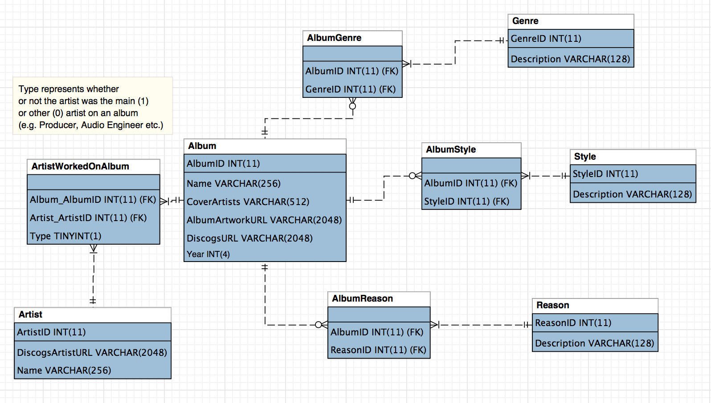

### albums

A collection of CSV/SQL files containing popular/acclaimed albums, used to make a inordinate list of albums to listen to.

This started by me merging a bunch of lists of music to listen to:

- [1001 Albums You Must Hear Before You Die](https://en.wikipedia.org/wiki/1001_Albums_You_Must_Hear_Before_You_Die) (merging multiple versions)
- [Rolling Stones' 500 Greatest Albums of All Time](https://www.rollingstone.com/music/music-lists/best-albums-of-all-time-1062063/)
- [NME: 500 Greatest Albums of All Time](https://www.albumoftheyear.org/list/209-nme-the-500-greatest-albums-of-all-time/)
- [Pitchforks Album of the Year](https://www.albumoftheyear.org/publication/1-pitchfork/lists/) (Just the Top Album)
- Albums that have won a:
  - [Mercury Prize](https://en.wikipedia.org/wiki/Mercury_Prize)
  - [Brit Award](https://en.wikipedia.org/wiki/BRIT_Award_for_British_Album_of_the_Year)
  - [AMA](https://en.wikipedia.org/wiki/American_Music_Awards)
  - [Grammy](https://en.wikipedia.org/wiki/Grammy_Award) (Any category)

None of these sources are particularly perfect or complete, but they make me to listen to some music I otherwise may have not given a chance.

This contains code to interact with my [spreadsheet](https://sean.fish/s/albums) -- listing the next albums I should listen to, validating the data using the Discogs API, or creating a SQL schema with the data

If you just want the data, see [`csv_data`](./csv_data) and [`sql_data`](./sql_data) for the sources/data. [`spreadsheets.csv`](./spreadsheet.csv) can be used to make your own spreadsheet, [`sql_data/score_statements.sql`](sql_data/score_statements.sql) is similar to that for SQL. I update these files periodically, whenever I update my own spreadsheet



### nextalbums

The command that is installed by following the instructions below:

```
Usage: nextalbums [OPTIONS] COMMAND [ARGS]...

  Interact with my albums spreadsheet!

Options:
  --help  Show this message and exit.

Commands:
  create-sql-statements  Creates MySQL compliant SQL statements to create a...
  discogs-update         Update rows on the spreadsheet which just have a...
  export                 Parse and print all of the information from the...
  favorites              List my favorites using the SQL Database
  generate-csv           Generate the spreadsheet.csv file in the root dir
  print-next             Print the next albums I should listen to
  update-csv-datafiles   Updates the CSV files in data directory
```

Four of those commands are related to updating the data files here:

- `nextalbums discogs-update` uses the [Discogs API](https://github.com/discogs/discogs_client) to fetch metadata and validate the data on [the spreadsheet](https://sean.fish/s/albums)
- `nextalbums generate-csv` updates the [`spreadsheet.csv`](./spreadsheet.csv) file
- `nextalbums update-csv-datafiles` queries the live SQL instance to update the files in [`csv_data`](./csv_data)
- `nextalbums create-sql-statements` uses the data from the spreadsheet to generate a `.sql` file, which when run creates the schema above. The [`sql_data/score_statements.sql`](sql_data/score_statements.sql) file contains all the data for my scores/listen on date, so I can query all that info through SQL. See below for example queries.

This entire process is managed by me using [`./update`](./update), which calls those in the required order to update all the data here

`nextalbums favorites` is a small script that queries my favorite albums using the live SQL instance

The part of this I use most often is `nextalbums print-next`, which prints the next albums from the spreadsheet I should listen to:

```
$ nextalbums print-next
+--------------------------------+---------------------------+------+
| Album                          | Artist                    | Year |
+--------------------------------+---------------------------+------+
| Aqua City                      | S. Kiyotaka & Omega Tribe | 1983 |
| F-1 Grand Prix World           | T-Square                  | 1992 |
| Serendipity 18                 | The Bob Florence Limited  | 1998 |
|                                | Edition                   |      |
| The Miseducation Of Lauryn     | Lauryn Hill               | 1998 |
| Hill                           |                           |      |
| This Is Hardcore               | Pulp                      | 1998 |
| This Is My Truth Tell Me Yours | Manic Street Preachers    | 1998 |
| Vol. 2... Hard Knock Life      | Jay-Z                     | 1998 |
| Vuelve                         | Ricky Martin              | 1998 |
| Wide Open Spaces               | Dixie Chicks              | 1998 |
| 13                             | Blur                      | 1999 |
+--------------------------------+---------------------------+------+
```

`nextalbums export` exports the entire active spreadsheet to JSON, extracting names out of the `sql_data` YAML cache files:

```JSON
{
  "score": 7.5,
  "note": null,
  "listened_on": "2019-02-19",
  "album_name": "Chet Baker Sings",
  "album_artwork_url": "https://img.discogs.com/KwmScXknIZQ3E9oyQiDjWRBwhDg=/fit-in/600x600/filters:strip_icc():format(jpeg):mode_rgb():quality(90)/discogs-images/R-2930625-1437056636-5751.jpeg.jpg",
  "cover_artists": "Chet Baker",
  "discogs_url": "https://www.discogs.com/master/60289",
  "year": 1954,
  "reasons": [
    "NME's 500 Greatest Albums of All Time"
  ],
  "genres": [
    "Jazz"
  ],
  "styles": [
    "Cool Jazz"
  ],
  "main_artists": [
    {
      "artist_id": 31617,
      "artist_name": "Chet Baker"
    }
  ],
  "other_artists": [
    {
      "artist_id": 31617,
      "artist_name": "Chet Baker"
    },
    {
      "artist_id": 1515883,
      "artist_name": "Allan Emig"
    },
    {
      "artist_id": 1914573,
      "artist_name": "William Claxton"
    },
```

I use that as part of [HPI](https://github.com/seanbreckenridge/HPI/blob/master/my/albums.py), which lets me use its query interface:

```bash
$ hpi query my.albums.history \
  | jq -r '.[] | select(.score>=9) | "\(.album_name) - \(.cover_artists)"' \
  | head -n5
Paranoid - Black Sabbath
Untitled - Led Zeppelin
The Stranger - Billy Joel
Solid State Survivor - Yellow Magic Orchestra
The Wall - Pink Floyd
```

### Sources for `spreadsheet.csv`:

Note for '1001 Albums You Must Hear Before You Die' and 'Rolling Stone's 500 Greatest Albums of All Time', the number of albums is above 1001 and 500 respectively, as there have been multiple versions of the book, and I've included anything that was ever on the list.

Note: The 'Rolling Stone's 500 Greatest of All Time' is a combination of the 2012 and earlier versions.

[`csv_data`](csv_data) also contains 3 files that list albums I added [Manually](csv_data/Manual.csv), on a [Recommendation](csv_data/Recommendation.csv), or because of a [Relation](csv_data/Relation.csv) (I liked an artist so I added more of their works). These albums are not listed in `spreadsheet.csv`

The format of all files in [`csv_data`](csv_data) except for [`all.csv`](csv_data/all.csv) and [`valid_albums.csv`](csv_data/valid_albums.csv) is:

`Album Name, Artists on Cover, Year, DiscogsURL, Genres, Styles`

`all.csv` contains albums I added manually, by relation, or on a recommendation, while `valid_albums.csv` does not. These CSV files also have a column that lists the Reason(s) the album is on the spreadsheet.

### Installation:

Configuration for this is handled by modifying the `settings.py` file in this directory. Since that is just a python file, you're free to modify that to pull items out of environment variables (`os.environ["ENVIRONMENT_VAR"]`) or read/files do anything else. You can run the file (`python3 settings.py`) to print the computed settings

1. Create your own copy of the [spreadsheet](https://docs.google.com/spreadsheets/d/12htSAMg67czl8cpkj1mX0TuAFvqL_PJLI4hv1arG5-M/edit#gid=1451660661).
  - You can open a new [google sheet](https://docs.google.com/spreadsheets/u/0/), and then File > Import [`spreadsheet.csv`](spreadsheet.csv) into a new google sheet.
  - I'd also recommend setting a fixed row height to ensure images are all the same size (You can do this by doing Ctrl/⌘ + A repeatedly till the margins are selected, and then resizing one row to your desired height.)
  - Name the sheet `Music` (near the bottom right)
2. Clone this repository `git clone https://github.com/seanbreckenridge/albums`, and install it using `pip install --editable .`, installing it as an editable package. This **won't** work as normal `pip install`, it **must** be editable
3. Create a file named `client_secret.json` in the root directory which contains your credentials for a google sheets OAuth connection. [Instructions for how to get your `client_secret.json` file here](https://pygsheets.readthedocs.io/en/staging/authorization.html); download your created credentials from [the Google credentials console](https://console.developers.google.com/apis/credentials)
4. Run `python3 setup_credentials.py` to authenticate this with the Google account you created the spreadsheet on
5. Update the `SPREADSHEET_ID` variable in `settings.py` - the ID is after the `/d/` in the URL when viewing it in Google Sheets
6. (If you want to add albums and validate them with `nextalbums discogs-update`) Create a file `discogs_token.yaml` in the root directory (info can be found [here](https://www.discogs.com/developers/), token [here](https://www.discogs.com/settings/developers)) with contents like:

```
user_agent: myPython3DiscogsClient/1.0
token: !!str FDJjksdfJkJFDNMoiweiIRWkj
```

### SQL

`nextalbums create-sql-statements` creates a file `statements.sql` that when run would create the following schema:


It can be run with the flag `--use-scores`, which adds the "Score" and "Listened On" columns to the "Album" Table, and creates the file `score_statements.sql`

Running it _without_ the `--use-scores` flag is close to what `statements.csv` in the root directory chooses as valid albums - only albums that have won at least 1 award, disregarding any albums I added to the spreadsheet manually, by relation, or on a recommendation.

This works on both MySQL/MariaDB.

##### Example Queries:

Anything that's won a grammy award:

```SQL
use albums;
SELECT Album.Name, Album.CoverArtists, Album.Year, GROUP_CONCAT(Reason.Description) as `Awards`
FROM Album
JOIN AlbumReason
	ON Album.AlbumID = AlbumReason.AlbumID
JOIN Reason
	ON AlbumReason.ReasonID = Reason.ReasonID
WHERE Reason.Description LIKE "Grammy%" # Anything that starts with "Grammy"
GROUP BY Album.AlbumID
ORDER BY COUNT(Reason.ReasonID) DESC # order by number of grammy awards
;
```

People who have worked on the most albums:

```SQL
USE albums;
SELECT  Name, artist.works
FROM Artist
JOIN
(
	SELECT Artist_ArtistID, count(Artist_ArtistID) as `works` FROM ArtistWorkedOnAlbum
	GROUP BY Artist_ArtistID
	ORDER BY `works` DESC
) AS artist
ON ArtistID = artist.Artist_ArtistID
WHERE artist.DiscogsArtistURL <> 'https://www.discogs.com/artist/194' -- 194 is various artists
ORDER BY works DESC
;
```

My Favorite Albums from the 80s:

```SQL
USE scorealbums;
SELECT Album.Name, Album.CoverArtists, Album.Year, Album.Score, Album.ListenedOn
FROM Album
WHERE Year > 1979 AND Year < 1990 AND SCORE IS NOT NULL
ORDER BY Album.Score DESC
LIMIT 25
;
```

Favorite Genres:

```SQL
USE scorealbums;
SELECT Genre.Description, AVG(Album.Score) as `Average Score`
FROM Album
JOIN AlbumGenre
	ON Album.AlbumID = AlbumGenre.AlbumID
JOIN Genre
	ON AlbumGenre.GenreID = Genre.GenreID
Where Album.Score IS NOT NULL
GROUP BY Genre.GenreID
ORDER BY `Average Score` DESC
;
```

Selecting for a specific genre:

```SQL
SELECT Album.Name, Album.CoverArtists, Album.Year, Album.Score
FROM Album
JOIN AlbumGenre
  ON Album.AlbumID = AlbumGenre.AlbumID
JOIN Genre
  ON AlbumGenre.GenreID = Genre.GenreID
WHERE Album.Score IS NOT NULL AND Genre.Description = "Funk / Soul"
ORDER BY Album.Score DESC;
```

### server

[`server`](./server) includes a flask server which grabs current information from spreadsheet:

```
'/' endpoint
get scored albums based on a few filters:
GET args:
limit=int, default 50
orderby=score|listened_on, default score
sort=asc|desc, defeault desc
```

```
'/artist' endpoint GET arg:
ids=id1,id2,id3,id4
(discogs artist IDs, which are returned in the response of '/')
```

Thats cached periodically and used to pull recent albums I've listened onto my 'Media Feed' window [on my website](https://sean.fish/)
