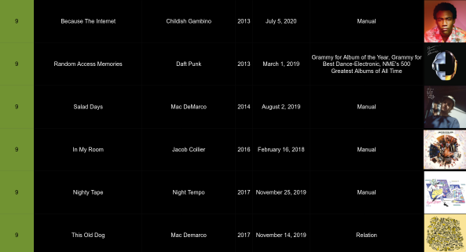

### albums

A collection of CSV files containing popular/acclaimed albums, used to make a inordinate list of albums to listen to.

This started by me merging a bunch of lists of music to listen to:

- [1001 Albums You Must Hear Before You Die](https://en.wikipedia.org/wiki/1001_Albums_You_Must_Hear_Before_You_Die) (merging multiple versions)
- [Rolling Stones' 500 Greatest Albums of All Time](https://www.rollingstone.com/music/music-lists/best-albums-of-all-time-1062063/)
- [NME: 500 Greatest Albums of All Time](https://www.albumoftheyear.org/list/209-nme-the-500-greatest-albums-of-all-time/)
- [Pitchforks Album of the Year](https://www.albumoftheyear.org/publication/1-pitchfork/lists/) (Just the Top Album)
- Albums that have won one of these awards (Pre-2023, am not sure if I'll continue to update this):
  - [Mercury Prize](https://en.wikipedia.org/wiki/Mercury_Prize)
  - [Brit Award](https://en.wikipedia.org/wiki/BRIT_Award_for_British_Album_of_the_Year)
  - [AMA](https://en.wikipedia.org/wiki/American_Music_Awards)
  - [Grammy](https://en.wikipedia.org/wiki/Grammy_Award)
- [Fantano's Top 200 Albums of the 2010s](https://www.youtube.com/watch?v=EyMX4lcKNPg)
- Misc. [Album Charts](./charts) that I've found to be interesting

None of these sources are particularly perfect or complete, but they make me to listen to some music I otherwise may have not given a chance. Only see it as slightly better than what I used to do in the past, i.e. scrolling through streaming services and picking whatever they happen to have featured. (Edit: as of now, am pretty comfortable using charts/recommendation lists to find things I'm more likely to be interested in, so will likely not update the Grammy/Mercury/AMA/Brit Awards from 2023 going forward, because I find my judgement for new music to be (slightly) better than what the award shows pick)

This contains code to interact with my [spreadsheet](https://sean.fish/s/albums) -- listing the next albums I should listen to, validating the data using the Discogs API

An older version of this repo is pushed to [`albums_old`](https://github.com/seanbreckenridge/albums_old) -- became difficult to maintain due to size concerns/constantly syncing changes to giant SQL files. This maintains a request cache instead, using [`url_cache`](https://github.com/seanbreckenridge/url_cache)



If you just want the data, see [`csv_data`](./csv_data). [`spreadsheets.csv`](./spreadsheet.csv) can be used to make your own spreadsheet

### nextalbums

The command that is installed by following the instructions below:

```
Usage: nextalbums [OPTIONS] COMMAND [ARGS]...

  Interact with my albums spreadsheet!

Options:
  --help  Show this message and exit.

Commands:
  discogs-update        use discogs to update sheet
  export                export sheet as JSON
  generate-csv          update spreadsheet.csv
  print-next            print next albums
  update-csv-datafiles  update csv datafiles
```

Three of those commands are related to updating the data files here:

- `nextalbums discogs-update` uses the [Discogs API](https://github.com/discogs/discogs_client) to fetch metadata and validate the data on [the spreadsheet](https://sean.fish/s/albums)
- `nextalbums generate-csv` updates the [`spreadsheet.csv`](./spreadsheet.csv) file
- `nextalbums update-csv-datafiles` updates the files in [`csv_data`](./csv_data)

This entire process is managed by me using [`./update`](./update), which calls those in the required order to update all the data here

The part of this I use most often is `nextalbums print-next`, which prints the next albums from the spreadsheet I should listen to:

```
$ nextalbums print-next
+--------------------------------+---------------------------+------+
| Album                          | Artist                    | Year |
+--------------------------------+---------------------------+------+
| Aqua City                      | S. Kiyotaka & Omega Tribe | 1983 |
| F-1 Grand Prix World           | T-Square                  | 1992 |
| Serendipity 18                 | The Bob Florence Limited  | 1998 |
|                                | Edition                   |      |
| The Miseducation Of Lauryn     | Lauryn Hill               | 1998 |
| Hill                           |                           |      |
| This Is Hardcore               | Pulp                      | 1998 |
| This Is My Truth Tell Me Yours | Manic Street Preachers    | 1998 |
| Vol. 2... Hard Knock Life      | Jay-Z                     | 1998 |
| Vuelve                         | Ricky Martin              | 1998 |
| Wide Open Spaces               | Dixie Chicks              | 1998 |
| 13                             | Blur                      | 1999 |
+--------------------------------+---------------------------+------+
```

`nextalbums export` exports the entire active spreadsheet to JSON:

```JSON
{
  "album_artwork_url": "https://i.discogs.com/2FN_VrOUSlSrOMhE7GDchtJlfNM1qI2dPZnE3blU1Nc/rs:fit/g:sm/q:40/h:150/w:150/czM6Ly9kaXNjb2dz/LWltYWdlcy9SLTI5/MzA2MjUtMTQzNzA1/NjYzNi01NzUxLmpw/ZWc.jpeg",
  "album_name": "Chet Baker Sings",
  "cover_artists": "Chet Baker",
  "discogs_url": "https://www.discogs.com/master/60289",
  "genres": [
    "Jazz"
  ],
  "listened_on": "2019-02-19",
  "main_artists": [
    31617
  ],
  "note": null,
  "reasons": [
    "NME's 500 Greatest Albums of All Time",
    "/mu/ Essentials"
  ],
  "score": 7.5,
  "styles": [
    "Cool Jazz"
  ],
  "year": 1954
}
```

I use that as part of my personal [HPI](https://github.com/seanbreckenridge/HPI-personal) modules, which lets me use its query interface:

```bash
$ hpi query 'my.nextalbums.history' \
  | jq -r '.[] | select(.score>=9) | "\(.album_name) - \(.cover_artists)"' \
  | head -n5
Paranoid - Black Sabbath
Untitled - Led Zeppelin
The Stranger - Billy Joel
Solid State Survivor - Yellow Magic Orchestra
The Wall - Pink Floyd
```

### Sources for `spreadsheet.csv`:

Note for '1001 Albums You Must Hear Before You Die' and 'Rolling Stone's 500 Greatest Albums of All Time', the number of albums is above 1001 and 500 respectively, as there have been multiple versions of the book, and I've included anything that was ever on the list.

Note: The 'Rolling Stone's 500 Greatest of All Time' is a combination of the 2012 and earlier versions.

### Installation:

Configuration for this is handled by modifying the `settings.py` file in this directory. Since that is just a python file, you're free to modify that to pull items out of environment variables (`os.environ["ENVIRONMENT_VAR"]`) or read/files do anything else. You can run the file (`python3 settings.py`) to print the computed settings

Note: To my knowledge, no one has ever done this yet, so if you have issues, feel free to open an [issue](https://github.com/seanbreckenridge/albums/issues/new)

1. Create your own copy of the [spreadsheet](https://docs.google.com/spreadsheets/d/12htSAMg67czl8cpkj1mX0TuAFvqL_PJLI4hv1arG5-M/edit#gid=1451660661).

- You can open a new [google sheet](https://docs.google.com/spreadsheets/u/0/), and then File > Import [`spreadsheet.csv`](spreadsheet.csv) into a new google sheet.
- I'd also recommend setting a fixed row height to ensure images are all the same size (You can do this by doing Ctrl/⌘ + A repeatedly till the margins are selected, and then resizing one row to your desired height.)
- Name the sheet `Music` (near the bottom left)

2. Clone this repository `git clone https://github.com/seanbreckenridge/albums`, and install it using `pip install --editable .`, installing it as an editable package. This **won't** work as normal `pip install`, it **must** be editable.
3. Create a file named `client_secret.json` in the root directory which contains your credentials for a google sheets OAuth connection. [Instructions for how to get your `client_secret.json` file here](https://pygsheets.readthedocs.io/en/staging/authorization.html); download your created credentials from [the Google credentials console](https://console.developers.google.com/apis/credentials)
4. Run `python3 setup_credentials.py` to authenticate this with the Google account you created the spreadsheet on
5. Update the `SPREADSHEET_ID` variable in `settings.py` - the ID is after the `/d/` in the URL when viewing it in Google Sheets
6. (If you want to add albums and validate them with `nextalbums discogs-update`) Create a file `discogs_token.yaml` in the root directory (info can be found [here](https://www.discogs.com/developers/), token [here](https://www.discogs.com/settings/developers)) with contents like:

```
user_agent: myPython3DiscogsClient/1.0
token: !!str FDJjksdfJkJFDNMoiweiIRWkj
```
